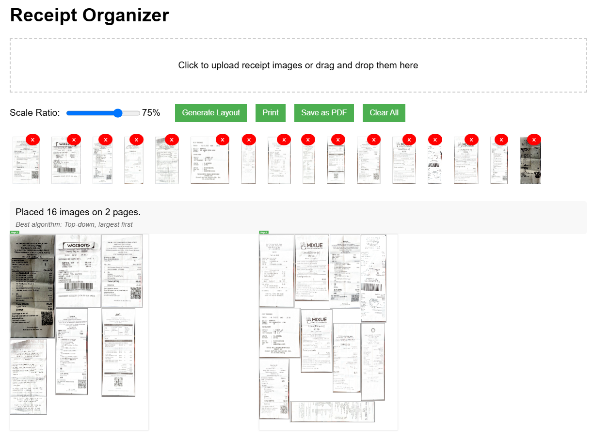

# auto_receipts_placing_on_a4paper
Best for employees reimbursement use, easily pleacing scanned receipt images on A4 sized papers optimumly

# DEMO
https://vyrox.com/ai/receipts.html



```html
<!DOCTYPE html>
<html lang="en">
<head>
    <meta charset="UTF-8">
    <meta name="viewport" content="width=device-width, initial-scale=1.0">
    <title>Receipt Organizer</title>
    <!-- Add PDF.js library -->
    <script src="https://cdnjs.cloudflare.com/ajax/libs/pdf.js/3.11.174/pdf.min.js"></script>
    <script>
        // Set the PDF.js worker source
        pdfjsLib.GlobalWorkerOptions.workerSrc = 'https://cdnjs.cloudflare.com/ajax/libs/pdf.js/3.11.174/pdf.worker.min.js';
    </script>
    <style>
        body {
            font-family: Arial, sans-serif;
            margin: 0 auto;
            padding: 20px;
            max-width: 1200px;
        }
        .upload-area {
            border: 2px dashed #ccc;
            padding: 20px;
            text-align: center;
            margin-bottom: 20px;
            cursor: pointer;
        }
        .upload-area:hover {
            background-color: #f8f8f8;
        }
        .controls {
            margin-bottom: 20px;
            display: flex;
            flex-wrap: wrap;
            align-items: center;
            gap: 10px;
        }
        .control-group {
            display: flex;
            align-items: center;
            margin-right: 15px;
        }
        .control-group label {
            margin-right: 8px;
        }
        .preview-container {
            display: flex;
            flex-wrap: wrap;
            gap: 10px;
            margin-bottom: 20px;
        }
        .preview-item {
            position: relative;
            margin: 5px;
        }
        .preview-item img {
            height: 80px;
            border: 1px solid #ddd;
        }
        .preview-item .remove-btn {
            position: absolute;
            top: -5px;
            right: -5px;
            background: red;
            color: white;
            border: none;
            border-radius: 50%;
            width: 20px;
            height: 20px;
            font-size: 12px;
            cursor: pointer;
            display: flex;
            align-items: center;
            justify-content: center;
        }
        .a4-page {
            width: 210mm;
            height: 297mm;
            background-color: white;
            box-shadow: 0 0 10px rgba(0,0,0,0.1);
            position: relative;
            margin-bottom: 20px;
            border: 1px solid #ddd;
            overflow: hidden;
            page-break-after: always;
        }
        .receipt-image {
            position: absolute;
            background-size: contain;
            background-repeat: no-repeat;
            background-position: center;
            border: 1px solid #000;
            box-sizing: border-box;
        }
        .receipt-wrapper {
            position: absolute;
            overflow: visible;
        }
        button {
            padding: 8px 12px;
            background-color: #4CAF50;
            color: white;
            border: none;
            cursor: pointer;
            margin-right: 5px;
        }
        button:hover {
            background-color: #45a049;
        }
        button:disabled {
            background-color: #cccccc;
            cursor: not-allowed;
        }
        .pages-preview {
            display: flex;
            flex-wrap: wrap;
            gap: 10px;
            margin-bottom: 20px;
        }
        .page-preview {
            width: 105mm;
            height: 148.5mm;
            background-color: white;
            border: 1px solid #ddd;
            box-shadow: 0 0 5px rgba(0,0,0,0.1);
            position: relative;
            transform: scale(0.3);
            transform-origin: top left;
            margin: 0 20px 40px 0;
        }
        .page-number {
            position: absolute;
            top: -20px;
            left: 0;
            background-color: #4CAF50;
            color: white;
            padding: 2px 8px;
            font-size: 12px;
        }
        .status {
            margin-top: 10px;
            padding: 10px;
            background-color: #f8f8f8;
            border-radius: 4px;
        }
        .algorithm-info {
            margin-top: 5px;
            font-size: 12px;
            color: #666;
            font-style: italic;
        }
        /* Loader styles */
        .loader-container {
            display: none;
            position: fixed;
            top: 0;
            left: 0;
            right: 0;
            bottom: 0;
            background-color: rgba(255, 255, 255, 0.8);
            z-index: 1000;
            justify-content: center;
            align-items: center;
            flex-direction: column;
        }
        .loader {
            border: 5px solid #f3f3f3;
            border-top: 5px solid #4CAF50;
            border-radius: 50%;
            width: 50px;
            height: 50px;
            animation: spin 1s linear infinite;
            margin-bottom: 15px;
        }
        .loader-text {
            color: #333;
            font-weight: bold;
        }
        @keyframes spin {
            0% { transform: rotate(0deg); }
            100% { transform: rotate(360deg); }
        }
        @media print {
            body * {
                visibility: hidden;
            }
            #pagesContainer, #pagesContainer * {
                visibility: visible;
            }
            #pagesContainer {
                position: absolute;
                left: 0;
                top: 0;
                width: 100%;
                margin: 0;
                padding: 0;
            }
            .a4-page {
                box-shadow: none;
                border: none;
                margin: 0;
                padding: 0;
            }
            .pages-preview, .status, .controls, header, h1, .loader-container {
                display: none !important;
            }
        }
    </style>
</head>
<body>
    <h1>Receipt Organizer</h1>
    
    <div class="upload-area" id="uploadArea">
        <p>Click to upload PDF files or drag and drop them here (Images will be extracted automatically)</p>
        <input type="file" id="fileInput" accept="application/pdf,image/*" style="display:none">
    </div>
    
    <div class="controls">
        <div class="control-group">
            <label for="scaleRatio">Scale Ratio:</label>
            <input type="range" id="scaleRatio" min="10" max="100" value="50" step="5">
            <span id="scaleValue">50%</span>
        </div>
        
        <button id="generateBtn">Generate Layout</button>
        <button id="printBtn">Print</button>
        <button id="savePdfBtn">Save as PDF</button>
        <button id="clearBtn">Clear All</button>
    </div>
    
    <div class="preview-container" id="previewContainer"></div>
    
    <div class="status" id="status"></div>
    
    <div class="pages-preview" id="pagesPreview"></div>
    
    <div id="pagesContainer"></div>
    
    <!-- Loader overlay -->
    <div class="loader-container" id="loaderContainer">
        <div class="loader"></div>
        <div class="loader-text" id="loaderText">Processing...</div>
    </div>
    
    <script>
        // Constants
        const A4_WIDTH_MM = 210;
        const A4_HEIGHT_MM = 297;
        const MM_TO_PX = 3.78; // Approximate conversion for screen display
        const SPACING = 3; // 3px spacing between images
        const BORDER_WIDTH = 1; // 1px border
        
        // Variables
        let receiptImages = [];
        let hasLayout = false;
        let isProcessing = false;
        
        // DOM Elements
        const uploadArea = document.getElementById('uploadArea');
        const fileInput = document.getElementById('fileInput');
        const generateBtn = document.getElementById('generateBtn');
        const printBtn = document.getElementById('printBtn');
        const savePdfBtn = document.getElementById('savePdfBtn');
        const clearBtn = document.getElementById('clearBtn');
        const previewContainer = document.getElementById('previewContainer');
        const pagesContainer = document.getElementById('pagesContainer');
        const pagesPreview = document.getElementById('pagesPreview');
        const scaleRatio = document.getElementById('scaleRatio');
        const scaleValue = document.getElementById('scaleValue');
        const statusEl = document.getElementById('status');
        const loaderContainer = document.getElementById('loaderContainer');
        const loaderText = document.getElementById('loaderText');
        
        // Event Listeners
        uploadArea.addEventListener('click', () => fileInput.click());
        uploadArea.addEventListener('dragover', (e) => {
            e.preventDefault();
            uploadArea.style.backgroundColor = '#f0f0f0';
        });
        uploadArea.addEventListener('dragleave', () => {
            uploadArea.style.backgroundColor = '';
        });
        uploadArea.addEventListener('drop', (e) => {
            e.preventDefault();
            uploadArea.style.backgroundColor = '';
            if (e.dataTransfer.files.length > 0) {
                handleFiles(e.dataTransfer.files);
            }
        });
        
        fileInput.addEventListener('change', () => {
            if (fileInput.files.length > 0) {
                handleFiles(fileInput.files);
            }
        });
        
        scaleRatio.addEventListener('input', () => {
            scaleValue.textContent = `${scaleRatio.value}%`;
        });
        
        generateBtn.addEventListener('click', () => {
            // Disable buttons and show loader
            setProcessingState(true);
            
            // Use setTimeout to allow UI to update before heavy processing
            setTimeout(() => {
                generateLayout();
                setProcessingState(false);
            }, 50);
        });
        
        printBtn.addEventListener('click', printPages);
        savePdfBtn.addEventListener('click', savePdf);
        clearBtn.addEventListener('click', clearAll);
        
        // PDF Extraction Functions
    async function extractImagesFromPDF(pdfFile) {
    const extractedImages = [];
    
    try {
        updateLoaderText("Loading PDF file...");
        // Load the PDF file
        const arrayBuffer = await pdfFile.arrayBuffer();
        updateLoaderText("Processing PDF content...");
        const loadingTask = pdfjsLib.getDocument(arrayBuffer);
        const pdf = await loadingTask.promise;
        
        updateLoaderText(`PDF loaded successfully. Found ${pdf.numPages} pages.`);
        statusEl.textContent = `Extracting images from ${pdf.numPages} pages...`;
        
        // Get the document data
        const data = await pdf.getData();
        const resources = data.resources || {};
        const xObjects = resources.XObject || {};
        
        // Process each page
        for (let i = 1; i <= pdf.numPages; i++) {
            updateLoaderText(`Analyzing page ${i} of ${pdf.numPages}...`);
            const page = await pdf.getPage(i);
            
            // Get page resources
            const pageResources = await page.getOperatorList();
            const imageNames = new Set();
            
            // Find all image objects in the page
            for (let j = 0; j < pageResources.fnArray.length; j++) {
                if (pageResources.fnArray[j] === pdfjsLib.OPS.paintImageXObject) {
                    const imageName = pageResources.argsArray[j][0];
                    if (imageName) {
                        imageNames.add(imageName);
                    }
                }
            }
            
            console.log(`Page ${i}: Found ${imageNames.size} potential image references`);
            
            // Process each image reference
            for (const imageName of imageNames) {
                try {
                    // Get the image data
                    const img = await page.objs.get(imageName);
                    
                    if (img) {
                        // Skip too small images (likely icons or decorations)
                        const tooSmall = img.width < 10 || img.height < 10;
                        
                        if (!tooSmall && (img.data || img.bitmap)) {
                            const canvas = document.createElement('canvas');
                            canvas.width = img.width;
                            canvas.height = img.height;
                            const ctx = canvas.getContext('2d');
                            
                            // Handle different types of image data
                            if (img.data) {
                                // Try to use the raw image data
                                const imageData = ctx.createImageData(img.width, img.height);
                                
                                if (img.data instanceof Uint8ClampedArray) {
                                    imageData.data.set(img.data);
                                } else if (img.data instanceof Uint8Array) {
                                    const clampedArray = new Uint8ClampedArray(img.data.buffer || img.data);
                                    imageData.data.set(clampedArray);
                                } else if (Array.isArray(img.data)) {
                                    // Convert array to Uint8ClampedArray
                                    const clampedArray = new Uint8ClampedArray(img.data);
                                    imageData.data.set(clampedArray);
                                }
                                
                                ctx.putImageData(imageData, 0, 0);
                            } else if (img.bitmap) {
                                // Use the bitmap if available
                                ctx.drawImage(img.bitmap, 0, 0);
                            }
                            
                            // Convert to data URL
                            try {
                                const dataURL = canvas.toDataURL('image/png');
                                
                                // Check if the image is not just a blank/transparent rectangle
                                // by sampling a few pixels and checking if they're all the same
                                const imgData = ctx.getImageData(0, 0, canvas.width, canvas.height).data;
                                let allSame = true;
                                const firstPixel = [imgData[0], imgData[1], imgData[2], imgData[3]];
                                
                                // Sample every 100 pixels
                                for (let p = 0; p < imgData.length; p += 400) {
                                    if (imgData[p] !== firstPixel[0] || 
                                        imgData[p+1] !== firstPixel[1] || 
                                        imgData[p+2] !== firstPixel[2] || 
                                        imgData[p+3] !== firstPixel[3]) {
                                        allSame = false;
                                        break;
                                    }
                                }
                                
                                // Skip if it's a blank/solid color image
                                if (!allSame && dataURL && dataURL.length > 100) {
                                    extractedImages.push({
                                        src: dataURL,
                                        width: img.width,
                                        height: img.height,
                                        page: i,
                                        index: extractedImages.length
                                    });
                                    console.log(`Extracted image from page ${i}, name: ${imageName}, size: ${img.width}x${img.height}`);
                                }
                            } catch (e) {
                                console.error(`Error converting to data URL for ${imageName}:`, e);
                            }
                        } else if (img.src) {
                            // Use image source if available
                            extractedImages.push({
                                src: img.src,
                                width: img.width || 100,
                                height: img.height || 100,
                                page: i,
                                index: extractedImages.length
                            });
                            console.log(`Used direct image src from page ${i}, name: ${imageName}`);
                        }
                    }
                } catch (imgError) {
                    console.error(`Error processing image ${imageName} on page ${i}:`, imgError);
                }
            }
            
            // Try a second approach if needed
            if (extractedImages.length === 0) {
                try {
                    // Extract image resources directly
                    const resourceNames = Object.keys(page.resources?.XObject || {});
                    
                    for (const resourceName of resourceNames) {
                        const resource = page.resources.XObject[resourceName];
                        
                        if (resource && resource.subtype === 'Image') {
                            // Try to extract the image data
                            const imageData = resource.data;
                            
                            if (imageData) {
                                const canvas = document.createElement('canvas');
                                canvas.width = resource.width;
                                canvas.height = resource.height;
                                const ctx = canvas.getContext('2d');
                                
                                const imgData = ctx.createImageData(resource.width, resource.height);
                                imgData.data.set(new Uint8ClampedArray(imageData.buffer || imageData));
                                ctx.putImageData(imgData, 0, 0);
                                
                                const dataURL = canvas.toDataURL('image/png');
                                
                                extractedImages.push({
                                    src: dataURL,
                                    width: resource.width,
                                    height: resource.height,
                                    page: i,
                                    index: extractedImages.length
                                });
                                console.log(`Extracted image resource from page ${i}, name: ${resourceName}`);
                            }
                        }
                    }
                } catch (resourceError) {
                    console.error(`Error extracting resource images from page ${i}:`, resourceError);
                }
            }
        }
        
        updateLoaderText(`Extraction complete. Found ${extractedImages.length} images.`);
        console.log(`Total images extracted: ${extractedImages.length}`);
        
        // If no images were found after all attempts, render pages as images as a last resort
        if (extractedImages.length === 0) {
            updateLoaderText("No individual images found. Attempting one more extraction method...");
            
            // Try using a different approach to extract images
            for (let i = 1; i <= pdf.numPages; i++) {
                const page = await pdf.getPage(i);
                
                // Get content streams
                const content = await page.getTextContent();
                const operatorList = await page.getOperatorList();
                
                // Extract image data directly from operator list
                for (let j = 0; j < operatorList.fnArray.length; j++) {
                    if (operatorList.fnArray[j] === pdfjsLib.OPS.paintJpegXObject ||
                        operatorList.fnArray[j] === pdfjsLib.OPS.paintImageXObject ||
                        operatorList.fnArray[j] === pdfjsLib.OPS.paintImageMaskXObject) {
                        
                        const args = operatorList.argsArray[j];
                        if (args && args.length > 0) {
                            const imgName = args[0];
                            const imgObj = await page.commonObjs.get(imgName) || await page.objs.get(imgName);
                            
                            if (imgObj && (imgObj.data || imgObj.bitmap)) {
                                const canvas = document.createElement('canvas');
                                canvas.width = imgObj.width || 200;
                                canvas.height = imgObj.height || 200;
                                const ctx = canvas.getContext('2d');
                                
                                try {
                                    if (imgObj.bitmap) {
                                        ctx.drawImage(imgObj.bitmap, 0, 0);
                                    } else if (imgObj.data) {
                                        const imgData = ctx.createImageData(imgObj.width, imgObj.height);
                                        imgData.data.set(new Uint8ClampedArray(imgObj.data.buffer || imgObj.data));
                                        ctx.putImageData(imgData, 0, 0);
                                    }
                                    
                                    const dataURL = canvas.toDataURL('image/png');
                                    extractedImages.push({
                                        src: dataURL,
                                        width: imgObj.width || 200,
                                        height: imgObj.height || 200,
                                        page: i,
                                        index: extractedImages.length
                                    });
                                } catch (err) {
                                    console.error(`Error processing alternative image extraction:`, err);
                                }
                            }
                        }
                    }
                }
            }
        }
        
        // As a last resort, render full pages
        if (extractedImages.length === 0) {
            updateLoaderText("Still no images found. Converting whole pages to images as fallback...");
            
            for (let i = 1; i <= Math.min(pdf.numPages, 20); i++) {
                const page = await pdf.getPage(i);
                const viewport = page.getViewport({ scale: 1.5 });
                
                const canvas = document.createElement('canvas');
                canvas.width = viewport.width;
                canvas.height = viewport.height;
                const ctx = canvas.getContext('2d');
                
                await page.render({
                    canvasContext: ctx,
                    viewport: viewport
                }).promise;
                
                const dataURL = canvas.toDataURL('image/png');
                extractedImages.push({
                    src: dataURL,
                    width: viewport.width,
                    height: viewport.height,
                    page: i,
                    index: extractedImages.length,
                    isFullPage: true
                });
                
                updateLoaderText(`Rendered page ${i} as image (fallback).`);
            }
        }
        
        return extractedImages;
        
    } catch (error) {
        console.error('Error extracting images from PDF:', error);
        updateLoaderText(`Error: ${error.message}`);
        statusEl.textContent = `Failed to extract images: ${error.message}`;
        
        // Try fallback as a last resort
        try {
            updateLoaderText("Trying final fallback approach...");
            const loadingTask = pdfjsLib.getDocument(await pdfFile.arrayBuffer());
            const pdf = await loadingTask.promise;
            
            for (let i = 1; i <= Math.min(pdf.numPages, 20); i++) {
                const page = await pdf.getPage(i);
                const viewport = page.getViewport({ scale: 1.5 });
                
                const canvas = document.createElement('canvas');
                canvas.width = viewport.width;
                canvas.height = viewport.height;
                const ctx = canvas.getContext('2d');
                
                await page.render({
                    canvasContext: ctx,
                    viewport: viewport
                }).promise;
                
                const dataURL = canvas.toDataURL('image/png');
                extractedImages.push({
                    src: dataURL,
                    width: viewport.width,
                    height: viewport.height,
                    page: i,
                    index: extractedImages.length,
                    isFullPage: true
                });
            }
            
            return extractedImages;
        } catch (fallbackError) {
            console.error('All extraction approaches failed:', fallbackError);
            alert(`Unable to extract images from this PDF: ${fallbackError.message}`);
            return [];
        }
    }
}
        
        function isValidImageData(data) {
            return data instanceof Uint8ClampedArray || 
                   data instanceof Uint8Array || 
                   data instanceof Array;
        }
        
        // Functions
        async function handleFiles(files) {
            setProcessingState(true);
            
            try {
                for (const file of Array.from(files)) {
                    if (file.type === 'application/pdf') {
                        updateLoaderText("Extracting images from PDF...");
                        const extractedImages = await extractImagesFromPDF(file);
                        updateLoaderText(`Found ${extractedImages.length} images in PDF...`);
                        
                        // Process each extracted image
                        for (let i = 0; i < extractedImages.length; i++) {
                            const imageData = extractedImages[i];
                            updateLoaderText(`Processing image ${i+1} of ${extractedImages.length}...`);
                            
                            // Create an image to get dimensions
                            const img = new Image();
                            await new Promise((resolve, reject) => {
                                img.onload = resolve;
                                img.onerror = reject;
                                img.src = imageData.src;
                            });
                            
                            // Add to receiptImages array
                            receiptImages.push({
                                src: imageData.src,
                                width: img.width,
                                height: img.height,
                                id: Date.now() + Math.random().toString(36).substr(2, 9)
                            });
                            
                            // Display in preview
                            displayPreview(receiptImages[receiptImages.length - 1]);
                        }
                    } else if (file.type.startsWith('image/')) {
                        const reader = new FileReader();
                        reader.onload = (e) => {
                            const img = new Image();
                            img.onload = () => {
                                const imageData = {
                                    src: e.target.result,
                                    width: img.width,
                                    height: img.height,
                                    id: Date.now() + Math.random().toString(36).substr(2, 9)
                                };
                                receiptImages.push(imageData);
                                displayPreview(imageData);
                            };
                            img.src = e.target.result;
                        };
                        reader.readAsDataURL(file);
                    }
                }
            } catch (error) {
                console.error("Error processing files:", error);
                alert("Error processing files: " + error.message);
            } finally {
                setProcessingState(false);
            }
        }
        
        function displayPreview(imageData) {
            const previewItem = document.createElement('div');
            previewItem.className = 'preview-item';
            previewItem.dataset.id = imageData.id;
            
            const preview = document.createElement('img');
            preview.src = imageData.src;
            
            const removeBtn = document.createElement('button');
            removeBtn.className = 'remove-btn';
            removeBtn.innerHTML = '×';
            removeBtn.addEventListener('click', () => {
                receiptImages = receiptImages.filter(img => img.id !== imageData.id);
                previewItem.remove();
            });
            
            previewItem.appendChild(preview);
            previewItem.appendChild(removeBtn);
            previewContainer.appendChild(previewItem);
        }
        
        function setProcessingState(isProcessing) {
            // Show/hide loader
            loaderContainer.style.display = isProcessing ? 'flex' : 'none';
            
            // Disable/enable buttons
            generateBtn.disabled = isProcessing;
            printBtn.disabled = isProcessing;
            savePdfBtn.disabled = isProcessing;
            clearBtn.disabled = isProcessing;
        }
        
        function updateLoaderText(text) {
            loaderText.textContent = text;
        }
        
        function updatePDFStatus(message) {
            statusEl.textContent = message;
        }
        
        function generateLayout() {
            if (receiptImages.length === 0) {
                alert('Please upload at least one receipt image.');
                return;
            }
            
            statusEl.textContent = "Generating and comparing layouts...";
            pagesContainer.innerHTML = '';
            pagesPreview.innerHTML = '';
            
            const a4WidthPx = A4_WIDTH_MM * MM_TO_PX;
            const a4HeightPx = A4_HEIGHT_MM * MM_TO_PX;
            const userScale = parseInt(scaleRatio.value) / 100;
            
            // Calculate the same scale ratio for all images
            updateLoaderText(`Scaling ${receiptImages.length} images to ${userScale * 100}% of original size to fit A4 paper...`);
            const scaledImages = calculateUniformScale(receiptImages, userScale, a4WidthPx, a4HeightPx);
            
            // Try different placement algorithms
            const results = [];
            
            // Algorithm 1: Top-down, left-to-right, largest first
            updateLoaderText("Trying algorithm 1 of 5: Top-down placement strategy, arranging largest images first to maximize space usage...");
            results.push(runPlacementAlgorithm(
                'Top-down, largest first',
                [...scaledImages].sort((a, b) => (b.scaledWidth * b.scaledHeight) - (a.scaledWidth * a.scaledHeight)),
                a4WidthPx,
                a4HeightPx
            ));
            
            // Algorithm 2: Top-down, left-to-right, widest first
            updateLoaderText("Trying algorithm 2 of 5: Top-down placement strategy, arranging widest images first to optimize horizontal spacing...");
            results.push(runPlacementAlgorithm(
                'Top-down, widest first',
                [...scaledImages].sort((a, b) => b.scaledWidth - a.scaledWidth),
                a4WidthPx,
                a4HeightPx
            ));
            
            // Algorithm 3: Top-down, left-to-right, tallest first
            updateLoaderText("Trying algorithm 3 of 5: Top-down placement strategy, arranging tallest images first to optimize vertical spacing...");
            results.push(runPlacementAlgorithm(
                'Top-down, tallest first',
                [...scaledImages].sort((a, b) => b.scaledHeight - a.scaledHeight),
                a4WidthPx,
                a4HeightPx
            ));
            
            // Algorithm 4: Bottom-up, left-to-right, largest first
            updateLoaderText("Trying algorithm 4 of 5: Bottom-up placement strategy, starting from bottom of page with largest images first...");
            results.push(runPlacementAlgorithm(
                'Bottom-up, largest first',
                [...scaledImages].sort((a, b) => (b.scaledWidth * b.scaledHeight) - (a.scaledWidth * a.scaledHeight)),
                a4WidthPx,
                a4HeightPx,
                true
            ));
            
            // Algorithm 5: Bottom-up alternating with top-down
            updateLoaderText("Trying algorithm 5 of 5: Alternating top-down & bottom-up strategy for optimal image distribution and space utilization...");
            results.push(runAlternatingAlgorithm(
                'Alternating top-down & bottom-up',
                [...scaledImages].sort((a, b) => (b.scaledWidth * b.scaledHeight) - (a.scaledWidth * a.scaledHeight)),
                a4WidthPx,
                a4HeightPx
            ));
            
            // Sort results by page count
            updateLoaderText(`Analyzing results from 5 different algorithms to find the most efficient layout (using fewest pages)...`);
            results.sort((a, b) => a.pageCount - b.pageCount);
            
            // Find the best result
            const bestResult = results[0];
            
            // Display the best result
            pagesContainer.innerHTML = '';
            bestResult.pages.forEach(page => {
                pagesContainer.appendChild(page);
            });
            
            // Update status
            statusEl.innerHTML = `<div>Placed ${bestResult.imagesPlaced} images on ${bestResult.pageCount} pages.</div>
                                 <div class="algorithm-info">Best algorithm: ${bestResult.algorithm}</div>`;
            
            // Create page previews
            updateLoaderText(`Creating thumbnail previews for ${bestResult.pageCount} pages for easy navigation...`);
            createPagePreviews();
            
            // Preload images for print
            updateLoaderText(`Preparing ${bestResult.imagesPlaced} images for high-quality printing and PDF export...`);
            preloadImagesForPrint();
            
            hasLayout = true;
        }
        
        function runPlacementAlgorithm(algorithmName, images, pageWidth, pageHeight, bottomUp = false) {
            // Clone images to not affect original array
            const imagesToPlace = [...images];
            
            // Create result container
            const result = {
                algorithm: algorithmName,
                pages: [],
                pageCount: 0,
                imagesPlaced: 0
            };
            
            let currentPage = document.createElement('div');
            currentPage.className = 'a4-page';
            result.pages.push(currentPage);
            result.pageCount++;
            
            let placementMap = createPlacementMap(pageWidth, pageHeight);
            
            let imagesPlaced = 0;
            let attempts = 0;
            const maxAttempts = imagesToPlace.length * 3;
            
            while (imagesToPlace.length > 0 && attempts < maxAttempts) {
                attempts++;
                const img = imagesToPlace.shift();
                
                // Add padding to account for border and spacing
                const totalWidth = img.scaledWidth + (BORDER_WIDTH * 2) + SPACING;
                const totalHeight = img.scaledHeight + (BORDER_WIDTH * 2) + SPACING;
                
                // Try placement based on algorithm
                let placed = false;
                let position;
                
                if (bottomUp) {
                    // Try bottom-up (both normal and rotated)
                    position = findBestPositionBottomUp(placementMap, totalWidth, totalHeight);
                    if (position) {
                        placeImageInResult(img, position.x, position.y, false, currentPage, placementMap);
                        placed = true;
                    } else {
                        position = findBestPositionBottomUp(placementMap, totalHeight, totalWidth);
                        if (position) {
                            placeImageInResult(img, position.x, position.y, true, currentPage, placementMap);
                            placed = true;
                        }
                    }
                } else {
                    // Try top-down (both normal and rotated)
                    position = findBestPositionTopDown(placementMap, totalWidth, totalHeight);
                    if (position) {
                        placeImageInResult(img, position.x, position.y, false, currentPage, placementMap);
                        placed = true;
                    } else {
                        position = findBestPositionTopDown(placementMap, totalHeight, totalWidth);
                        if (position) {
                            placeImageInResult(img, position.x, position.y, true, currentPage, placementMap);
                            placed = true;
                        }
                    }
                }
                
                // If we couldn't place it, create a new page and try again
                if (!placed) {
                    currentPage = document.createElement('div');
                    currentPage.className = 'a4-page';
                    result.pages.push(currentPage);
                    result.pageCount++;
                    
                    placementMap = createPlacementMap(pageWidth, pageHeight);
                    
                    // Try again on the new page
                    if (bottomUp) {
                        position = findBestPositionBottomUp(placementMap, totalWidth, totalHeight);
                        if (position) {
                            placeImageInResult(img, position.x, position.y, false, currentPage, placementMap);
                            placed = true;
                        } else {
                            position = findBestPositionBottomUp(placementMap, totalHeight, totalWidth);
                            if (position) {
                                placeImageInResult(img, position.x, position.y, true, currentPage, placementMap);
                                placed = true;
                            }
                        }
                    } else {
                        position = findBestPositionTopDown(placementMap, totalWidth, totalHeight);
                        if (position) {
                            placeImageInResult(img, position.x, position.y, false, currentPage, placementMap);
                            placed = true;
                        } else {
                            position = findBestPositionTopDown(placementMap, totalHeight, totalWidth);
                            if (position) {
                                placeImageInResult(img, position.x, position.y, true, currentPage, placementMap);
                                placed = true;
                            }
                        }
                    }
                    
                    // If still can't place, scale it down and try again
                    if (!placed) {
                        const scaleDown = 0.9;
                        img.scaledWidth = Math.floor(img.scaledWidth * scaleDown);
                        img.scaledHeight = Math.floor(img.scaledHeight * scaleDown);
                        imagesToPlace.push(img); // Put back in queue
                        continue;
                    }
                }
                
                imagesPlaced++;
            }
            
            result.imagesPlaced = imagesPlaced;
            return result;
        }
        
        function runAlternatingAlgorithm(algorithmName, images, pageWidth, pageHeight) {
            // Clone images to not affect original array
            const imagesToPlace = [...images];
            
            // Create result container
            const result = {
                algorithm: algorithmName,
                pages: [],
                pageCount: 0,
                imagesPlaced: 0
            };
            
            let currentPage = document.createElement('div');
            currentPage.className = 'a4-page';
            result.pages.push(currentPage);
            result.pageCount++;
            
            let placementMap = createPlacementMap(pageWidth, pageHeight);
            
            let imagesPlaced = 0;
            let attempts = 0;
            const maxAttempts = imagesToPlace.length * 3;
            
            while (imagesToPlace.length > 0 && attempts < maxAttempts) {
                attempts++;
                const img = imagesToPlace.shift();
                
                // Add padding to account for border and spacing
                const totalWidth = img.scaledWidth + (BORDER_WIDTH * 2) + SPACING;
                const totalHeight = img.scaledHeight + (BORDER_WIDTH * 2) + SPACING;
                
                // Try alternating placements
                let placed = false;
                let position;
                
                // Try multiple strategies for each image
                // 1. Try top-down normal
                position = findBestPositionTopDown(placementMap, totalWidth, totalHeight);
                if (position) {
                    placeImageInResult(img, position.x, position.y, false, currentPage, placementMap);
                    placed = true;
                } else {
                    // 2. Try bottom-up normal
                    position = findBestPositionBottomUp(placementMap, totalWidth, totalHeight);
                    if (position) {
                        placeImageInResult(img, position.x, position.y, false, currentPage, placementMap);
                        placed = true;
                    } else {
                        // 3. Try top-down rotated
                        position = findBestPositionTopDown(placementMap, totalHeight, totalWidth);
                        if (position) {
                            placeImageInResult(img, position.x, position.y, true, currentPage, placementMap);
                            placed = true;
                        } else {
                            // 4. Try bottom-up rotated
                            position = findBestPositionBottomUp(placementMap, totalHeight, totalWidth);
                            if (position) {
                                placeImageInResult(img, position.x, position.y, true, currentPage, placementMap);
                                placed = true;
                            }
                        }
                    }
                }
                
                // If we couldn't place it, create a new page and try again
                if (!placed) {
                    currentPage = document.createElement('div');
                    currentPage.className = 'a4-page';
                    result.pages.push(currentPage);
                    result.pageCount++;
                    
                    placementMap = createPlacementMap(pageWidth, pageHeight);
                    
                    // Try again on the new page (same sequence)
                    position = findBestPositionTopDown(placementMap, totalWidth, totalHeight);
                    if (position) {
                        placeImageInResult(img, position.x, position.y, false, currentPage, placementMap);
                        placed = true;
                    } else {
                        position = findBestPositionBottomUp(placementMap, totalWidth, totalHeight);
                        if (position) {
                            placeImageInResult(img, position.x, position.y, false, currentPage, placementMap);
                            placed = true;
                        } else {
                            position = findBestPositionTopDown(placementMap, totalHeight, totalWidth);
                            if (position) {
                                placeImageInResult(img, position.x, position.y, true, currentPage, placementMap);
                                placed = true;
                            } else {
                                position = findBestPositionBottomUp(placementMap, totalHeight, totalWidth);
                                if (position) {
                                    placeImageInResult(img, position.x, position.y, true, currentPage, placementMap);
                                    placed = true;
                                }
                            }
                        }
                    }
                    
                    // If still can't place, scale it down and try again
                    if (!placed) {
                        const scaleDown = 0.9;
                        img.scaledWidth = Math.floor(img.scaledWidth * scaleDown);
                        img.scaledHeight = Math.floor(img.scaledHeight * scaleDown);
                        imagesToPlace.push(img); // Put back in queue
                        continue;
                    }
                }
                
                imagesPlaced++;
            }
            
            result.imagesPlaced = imagesPlaced;
            return result;
        }
        
        function placeImageInResult(img, x, y, rotated, page, placementMap) {
            // Calculate final dimensions (including border)
            const totalWidth = img.scaledWidth + (BORDER_WIDTH * 2) + SPACING;
            const totalHeight = img.scaledHeight + (BORDER_WIDTH * 2) + SPACING;
            
            // Mark area as occupied in the placement map
            if (rotated) {
                markAreaOccupied(placementMap, x, y, totalHeight, totalWidth);
            } else {
                markAreaOccupied(placementMap, x, y, totalWidth, totalHeight);
            }
            
            // Adjust x and y to account for border
            const adjustedX = x + BORDER_WIDTH;
            const adjustedY = y + BORDER_WIDTH;
            
            if (rotated) {
                // Create a wrapper for rotated image
                const wrapper = document.createElement('div');
                wrapper.className = 'receipt-wrapper';
                wrapper.style.left = `${adjustedX}px`;
                wrapper.style.top = `${adjustedY}px`;
                wrapper.style.width = `${img.scaledHeight}px`;
                wrapper.style.height = `${img.scaledWidth}px`;
                
                const receipt = document.createElement('div');
                receipt.className = 'receipt-image';
                receipt.style.backgroundImage = `url(${img.src})`;
                receipt.style.width = `${img.scaledWidth}px`;
                receipt.style.height = `${img.scaledHeight}px`;
                receipt.style.transformOrigin = 'top left';
                receipt.style.transform = 'rotate(90deg) translateY(-100%)';
                
                wrapper.appendChild(receipt);
                page.appendChild(wrapper);
            } else {
                // Place normal orientation
                const receipt = document.createElement('div');
                receipt.className = 'receipt-image';
                receipt.style.backgroundImage = `url(${img.src})`;
                receipt.style.width = `${img.scaledWidth}px`;
                receipt.style.height = `${img.scaledHeight}px`;
                receipt.style.left = `${adjustedX}px`;
                receipt.style.top = `${adjustedY}px`;
                
                page.appendChild(receipt);
            }
        }
        
        function preloadImagesForPrint() {
            // Find all receipt-image elements
            const receiptElements = document.querySelectorAll('.receipt-image');
            
            // For each receipt, create an actual img element to ensure it prints
            receiptElements.forEach(receipt => {
                const bgImage = getComputedStyle(receipt).backgroundImage;
                const url = bgImage.slice(5, -2); // Extract URL from 'url("...")'
                
                // Create an img element
                const img = document.createElement('img');
                img.src = url;
                img.style.width = '100%';
                img.style.height = '100%';
                img.style.objectFit = 'contain';
                img.style.position = 'absolute';
                img.style.left = '0';
                img.style.top = '0';
                
                // Add to the receipt element
                receipt.appendChild(img);
                
                // Keep the border
                receipt.style.backgroundImage = 'none';
            });
        }
        
        function calculateUniformScale(images, userScale, pageWidth, pageHeight) {
            // Find the maximum dimension (width or height) of all images
            let maxDimension = 0;
            images.forEach(img => {
                maxDimension = Math.max(maxDimension, img.width, img.height);
            });
            
            // Calculate a scale factor that would make the largest image fit on the page
            const maxScaleFactor = Math.min(
                (pageWidth / maxDimension) * userScale,
                (pageHeight / maxDimension) * userScale
            );
            
            // Apply this scale factor to all images
            return images.map(img => ({
                ...img,
                scaledWidth: Math.floor(img.width * maxScaleFactor),
                scaledHeight: Math.floor(img.height * maxScaleFactor)
            }));
        }
        
        function createPlacementMap(width, height) {
            // Create a 2D array representation of the page
            // True means space is occupied, false means it's free
            return Array(Math.ceil(height)).fill().map(() => 
                Array(Math.ceil(width)).fill(false)
            );
        }
        
        function isAreaFree(map, startX, startY, width, height) {
            // Check if the entire area is free
            for (let y = startY; y < startY + height; y++) {
                for (let x = startX; x < startX + width; x++) {
                    if (y >= map.length || x >= map[0].length || map[y][x]) {
                        return false;
                    }
                }
            }
            return true;
        }

        function markAreaOccupied(map, startX, startY, width, height) {
            // Mark the area as occupied
            for (let y = startY; y < startY + height; y++) {
                for (let x = startX; x < startX + width; x++) {
                    if (y < map.length && x < map[0].length) {
                        map[y][x] = true;
                    }
                }
            }
        }
        
        function findBestPositionTopDown(map, width, height) {
            // Start from top, scan left to right, top to bottom
            const pageWidth = map[0].length;
            const pageHeight = map.length;
            
            // Ensure the image fits on the page
            if (width > pageWidth || height > pageHeight) {
                return null;
            }
            
            // Find first available position
            for (let y = 0; y <= pageHeight - height; y++) {
                for (let x = 0; x <= pageWidth - width; x++) {
                    if (isAreaFree(map, x, y, width, height)) {
                        return { x, y };
                    }
                }
            }
            
            return null;
        }
        
        function findBestPositionBottomUp(map, width, height) {
            // Start from bottom, scan left to right, bottom to top
            const pageWidth = map[0].length;
            const pageHeight = map.length;
            
            // Ensure the image fits on the page
            if (width > pageWidth || height > pageHeight) {
                return null;
            }
            
            // Find first available position from bottom
            for (let y = pageHeight - height; y >= 0; y--) {
                for (let x = 0; x <= pageWidth - width; x++) {
                    if (isAreaFree(map, x, y, width, height)) {
                        return { x, y };
                    }
                }
            }
            
            return null;
        }
        
        function createNewPage() {
            const page = document.createElement('div');
            page.className = 'a4-page';
            pagesContainer.appendChild(page);
            return page;
        }
        
        function createPagePreviews() {
            const pages = pagesContainer.querySelectorAll('.a4-page');
            
            pages.forEach((page, index) => {
                const preview = document.createElement('div');
                preview.className = 'page-preview';
                
                // Clone the content of the page
                const pageClone = page.cloneNode(true);
                preview.appendChild(pageClone);
                
                const pageNumber = document.createElement('div');
                pageNumber.className = 'page-number';
                pageNumber.textContent = `Page ${index + 1}`;
                preview.appendChild(pageNumber);
                
                // Add click handler to show full page
                preview.addEventListener('click', () => {
                    // Scroll to the corresponding page
                    page.scrollIntoView({ behavior: 'smooth' });
                });
                
                pagesPreview.appendChild(preview);
            });
        }
        
        function printPages() {
            if (!hasLayout) {
                alert('Please generate the layout first.');
                return;
            }
            
            // Print the document
            window.print();
        }
        
        function savePdf() {
            if (!hasLayout) {
                alert('Please generate the layout first.');
                return;
            }
            
            // Show instructions for saving as PDF
            const instructions = `
                To save as PDF:
                1. Click the "Print" button
                2. In the print dialog, select "Save as PDF" as the destination
                3. Click "Save"
                
                Would you like to proceed to the print dialog?
            `;
            
            if (confirm(instructions)) {
                window.print();
            }
        }
        
        function clearAll() {
            receiptImages = [];
            previewContainer.innerHTML = '';
            pagesContainer.innerHTML = '';
            pagesPreview.innerHTML = '';
            statusEl.textContent = '';
            fileInput.value = '';
            hasLayout = false;
        }
    </script>
</body>
</html>
